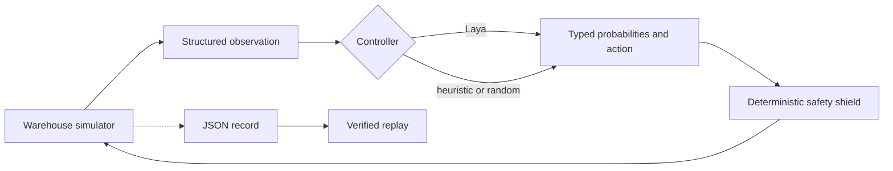

<div align="center">

# Laya Warehouse Safety

**A typed decision model, a busy warehouse, and one robot trying not to become an incident report.**

</div>

This project is a visual, replayable experiment in using
[Laya](https://github.com/NandhaKishorM/laya) as a fast operational decision layer for an
autonomous warehouse robot. Workers and forklifts move through a deterministic grid. The robot
must reach a loading bay while choosing whether to advance, shift, or wait.

The simulation keeps emergency collision prevention deterministic. Laya chooses operational
actions above that safety layer; it cannot override the safety shield.

## Why this experiment?

Laya evaluates several typed questions over one state in a single model invocation. A warehouse
crossing makes the result visible: a late or poor decision can cause an avoidable stop, detour, or
collision in an unshielded research run.

Each model invocation evaluates these outputs in parallel:

- `action` — `choice`: a normalized distribution over advance, shift left, shift right, and wait.
- `collision_risk` — `score`: low through critical.
- `path_blocked` — `noul`: probability that the direct path is blocked.
- `needs_operator` — `noul`: probability that a person should review the situation.

The controller applies Laya's selected action. Keeping all actions in one normalized choice avoids
comparing probabilities from separately phrased binary questions.

Generic Laya checkpoints are useful baselines, but they are not warehouse policies. The repository
therefore generates its own balanced training states and provides a small domain fine-tuning path.
No external package, incident, or robotics dataset is required.

This repository is an experiment, not a certified robotics safety system.

## Architecture



Laya receives structured positions and motion descriptions. It does not process rendered pixels.

## Quick start

The headless simulator and tests have no runtime dependencies:

```sh
python -m venv .venv
source .venv/bin/activate
pip install -e .
python -m unittest discover -s tests

laya-warehouse run --controller heuristic --headless --output results/heuristic.json
laya-warehouse replay results/heuristic.json --headless
laya-warehouse make-dataset --per-action 128 --output results/train.jsonl
```

Install the visual renderer:

```sh
pip install -e '.[visual]'
laya-warehouse run --controller heuristic --output results/visual.json
```

Install Laya and run the model controller:

```sh
pip install -e '.[visual,laya]'
laya-warehouse run --controller laya --output results/laya.json
```

The first Laya run downloads the selected model checkpoint. Pass `--model` to use another model ID
or a local checkpoint, and `--device` to select `cpu`, `cuda`, or `mps`.

The recorder refuses to overwrite an existing result. Choose a new output path for each run.

## Recorded visual replay

Clone the repository and open [`demo/index.html`](demo/index.html) in a browser. The self-contained
viewer replays the verified DGX Spark episode without a server. It shows the warehouse state,
requested and applied actions, action probabilities, latency, and every safety override by tick.

The included record is data, not a scripted animation. Use the controls or arrow keys to inspect
the proactive pallet detour and the later worker-traffic interventions.

## Synthetic policy data

`make-dataset` creates equal numbers of four situations:

- Advance when the route toward the loading bay is clear.
- Shift left or right when a stationary pallet blocks the route and the shift improves alignment.
- Wait when moving cross-aisle traffic will enter the next cell.

Every JSONL row contains the structured simulator state and its labeled best action. A seed makes
the output reproducible, and a separate seed produces held-out evaluation states.

### DGX Spark container

The container preserves NVIDIA's ARM64/Blackwell PyTorch build from the pinned NGC base image. It
does not replace Torch with a PyPI wheel.

```sh
docker compose build simulation
docker compose run --rm simulation
```

The first run downloads the Laya checkpoint into the `laya-cache` Docker volume and writes the
episode to `results/laya-dgx.json`.

Fine-tune the smaller Laya checkpoint on generated states, then run the learned policy:

```sh
docker compose run --rm --entrypoint python simulation \
  scripts/train_laya_policy.py --output /results/laya-warehouse-model

docker compose run --rm simulation run \
  --controller laya \
  --model /results/laya-warehouse-model \
  --device cuda \
  --headless \
  --output /results/laya-finetuned-dgx.json
```

Training records baseline and per-epoch held-out accuracy in
`results/laya-warehouse-model/training_metrics.json`. Both training and episode commands refuse to
overwrite prior outputs.

## Measured DGX Spark run

The included replay was produced from commit `829c16a` on a DGX Spark:

- 512 balanced simulator-generated training states and 128 held-out states.
- Action accuracy improved from 25% zero-shot to 100% on the held-out synthetic split.
- Three epochs completed in 75.83 seconds; the best checkpoint was epoch 2.
- The robot completed the crossing in 17 ticks.
- Laya requested the pallet detour itself with 71.86% probability.
- Median inference latency was 58.2 ms; the 816.5 ms maximum includes cold model startup.
- The safety shield made three moving-worker interventions and no pallet intervention.

The held-out states come from the same deterministic generator family. These numbers demonstrate
the software path and domain specialization; they are not evidence of real-world robot safety.

## Current milestone

- Deterministic crossing scenario with workers, a forklift, and a stationary pallet.
- Structured observations suitable for Laya.
- Balanced deterministic dataset generation with no external corpus.
- Single-GPU domain fine-tuning with held-out action accuracy.
- Heuristic, seeded-random, and Laya controllers.
- Safety shield that records every overridden action.
- JSON recording and deterministic replay verification.
- Optional Pygame visualization.
- Browser-based replay of the recorded DGX Spark run.
- Pinned DGX Spark GPU container path.

Planned work includes scenario files, real-time and delayed decision modes, probability overlays,
additional held-out scenarios, and curated replay media.

## License

Apache-2.0. See [LICENSE](LICENSE).
