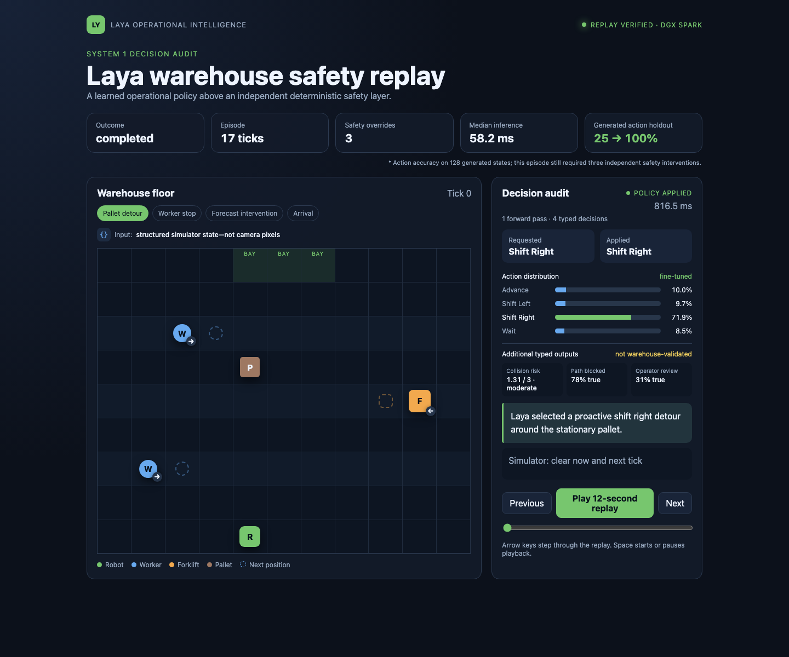
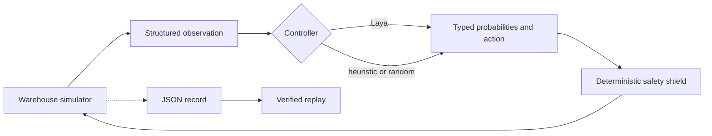

<div align="center">

# Laya Warehouse Safety

**A typed decision model, a busy warehouse, and one robot trying not to become an incident report.**

</div>

This project is a visual, replayable experiment in using
[Laya](https://github.com/NandhaKishorM/laya) as a fast operational decision layer for an
autonomous warehouse robot. Workers and forklifts move through a deterministic grid. The robot
must reach a loading bay while choosing whether to advance, shift, or wait.

The simulation keeps emergency collision prevention deterministic. Laya chooses operational
actions above that safety layer; it cannot override the safety shield.



## Why this experiment?

Laya evaluates several typed questions over one state in a single model invocation. A warehouse
crossing makes the result visible: a late or poor decision can cause an avoidable stop, detour, or
collision in an unshielded research run.

The included browser replay evaluates these outputs in parallel:

- `action` — `choice`: a normalized distribution over advance, shift left, shift right, and wait.
- `collision_risk` — `score`: low through critical.
- `path_blocked` — `noul`: probability that the direct path is blocked.
- `needs_operator` — `noul`: probability that a person should review the situation.

The controller applies Laya's selected action. Keeping all actions in one normalized choice avoids
comparing probabilities from separately phrased binary questions.

That replay's model was domain-trained only for `action`. It preserves the other three outputs to
demonstrate Laya's typed interface, but they are unvalidated diagnostics. Do not interpret them as
calibrated warehouse risk or escalation signals.

The reproducible benchmark trains and evaluates only `action` and `path_blocked`. It does not train
`collision_risk` or `needs_operator`, and makes no calibration claim about either one.

Generic Laya checkpoints are useful baselines, but they are not warehouse policies. The repository
therefore generates its own frozen training states and provides a small domain fine-tuning path.
No external package, incident, or robotics dataset is required.

This repository is an experiment, not a certified robotics safety system.

## Architecture



Laya receives structured positions and motion descriptions. It does not process rendered pixels.

## Quick start

The headless simulator and tests have no runtime dependencies:

```sh
python -m venv .venv
source .venv/bin/activate
pip install -e .
python -m unittest discover -s tests

laya-warehouse run --controller heuristic --headless --output results/heuristic.json
laya-warehouse replay results/heuristic.json --headless
laya-warehouse make-dataset --split train --output results/train.jsonl
```

Install the visual renderer:

```sh
pip install -e '.[visual]'
laya-warehouse run --controller heuristic --output results/visual.json
```

Install Laya and run the model controller:

```sh
pip install -e '.[visual,laya]'
laya-warehouse run --controller laya --output results/laya.json
```

The first Laya run downloads the selected model checkpoint. Pass `--model` to use another model ID
or a local checkpoint, and `--device` to select `cpu`, `cuda`, or `mps`.

The recorder refuses to overwrite an existing result. Choose a new output path for each run.

## Recorded visual replay

Clone the repository and open [`demo/index.html`](demo/index.html) in a browser. The self-contained
viewer replays the verified DGX Spark episode without a server. It shows the warehouse state,
requested and applied actions, the four typed outputs from one forward pass, latency, motion
forecasts, and every safety override by tick. Only the action distribution is domain-trained.

The included record is data, not a scripted animation. Use the controls or arrow keys to inspect
the proactive pallet detour and the later worker-traffic interventions.

## Frozen scenarios and policy data

Manifest version 2 has three immutable scenario families and two evaluation roles:

| Family | Training | Validation | Development | Frozen final |
|---|---:|---:|---:|---:|
| Stationary pallet | 20 | 6 | 8 IID | 8 IID |
| Crossing worker | 20 | 6 | 8 IID | 8 IID |
| Combined pallet and worker | 0 | 0 | 16 OOD | 16 OOD |

The combined family is never used for training or checkpoint selection. The development manifest
was used while correcting label weighting and choosing the epoch budget, so its model results are
development evidence—not an untouched generalization result. The final manifest was frozen
afterward with disjoint scenario IDs and hazard rows absent from the development set; its digest is
pinned in tests before any final model execution.

`make-dataset` rolls the deterministic oracle through one named split. Each JSONL row contains a
raw simulator observation plus separate `action` and `path_blocked` labels. Model observations do
not contain candidate safety, oracle actions, shield decisions, or labels.

Training keeps every generated row, adds its horizontal mirror with freshly computed oracle labels,
and applies inverse-frequency loss weights per question and label. Mirroring exposes reflected
layouts; weighting gives every label equal total loss weight. This prevents the many clear-path
`advance` states from overwhelming rarer detour and wait decisions without changing the validation
or benchmark distributions.

The oracle finds the shortest collision-free route. Equal-length routes minimize lateral moves,
then waits, then use this fixed action order: advance, shift left, shift right, wait. The
`path_blocked` label means that forward-only travel in the robot's current column becomes unsafe
within the next three ticks under deterministic actor motion.

Generate any frozen split with:

```sh
laya-warehouse make-dataset --split validation --output results/validation.jsonl
```

## Reproducible benchmark

The benchmark runs fine-tuned Laya, the deterministic heuristic, and a seeded-random policy over
the same IID and compositional OOD manifest. By default it selects the frozen final manifest. Every
controller is measured twice:

- `policy_only` disables collision shielding while retaining the grid boundary guard.
- `layered` enables the deterministic collision shield.

The versioned JSON report includes completion, collision, timeout, unsafe-request, boundary-guard,
shield-intervention, unnecessary-wait, route-length, oracle-action, and `path_blocked` metrics by
family.
It also separates model load and first-inference latency from warm Laya p50 and p95 latency.
Selected episodes from every controller, track, and family are saved as replay-verifiable JSON.

Run it against a fine-tuned checkpoint:

```sh
python scripts/run_benchmark.py \
  --model results/laya-warehouse-model \
  --device cuda \
  --output results/benchmark-v1.json \
  --episodes-dir results/benchmark-v1-episodes
```

The report contains a manifest digest and a deterministic result digest. Runtime measurements are
reported separately and are excluded from the deterministic digest.

See [`benchmarks/README.md`](benchmarks/README.md) for the preserved development history, one-shot
final results, and replay-verifiable evidence.

To reproduce the earlier tuning evidence instead, pass `--manifest-role development`. Never report
that manifest as an untouched final test.

### DGX Spark container

The container preserves NVIDIA's ARM64/Blackwell PyTorch build from the pinned NGC base image. It
does not replace Torch with a PyPI wheel.

```sh
docker compose build simulation
docker compose run --rm simulation
```

The first run downloads the Laya checkpoint into the `laya-cache` Docker volume and writes the
episode to `results/laya-dgx.json`.

Fine-tune the smaller Laya checkpoint on generated states, then run the learned policy:

```sh
docker compose run --rm --entrypoint python simulation \
  scripts/train_laya_policy.py --epochs 8 --output /results/laya-warehouse-model

docker compose run --rm simulation run \
  --controller laya \
  --model /results/laya-warehouse-model \
  --device cuda \
  --headless \
  --output /results/laya-finetuned-dgx.json
```

Training records baseline and per-epoch validation metrics for both trained questions in
`results/laya-warehouse-model/training_metrics.json`. The action report includes each label's exact
support, macro accuracy, and minimum label accuracy. Checkpoint selection prioritizes minimum
per-label action accuracy, then action macro accuracy, `path_blocked` accuracy, and lower Brier
score. The current validation split has only three examples for each lateral label, so those recall
values are development signals rather than stable estimates. Training, benchmark, and episode
commands refuse to overwrite prior outputs.

## Measured DGX Spark run

The included replay was produced from commit `829c16a` on a DGX Spark:

- 512 balanced simulator-generated action-training states and 128 held-out action states.
- Action accuracy improved from 25% zero-shot to 100% on the held-out synthetic split.
- Three epochs completed in 75.83 seconds; the best checkpoint was epoch 2.
- The robot completed the crossing in 17 ticks.
- Laya requested the pallet detour itself with 71.86% probability.
- Median inference latency was 58.2 ms; the 816.5 ms maximum includes cold model startup.
- The safety shield made three moving-worker interventions and no pallet intervention.

This older browser-replay run predates the frozen compositional benchmark above. Its held-out states
come from the same deterministic generator family. These numbers demonstrate the software path and
action specialization; they are not evidence of real-world robot safety.
The three shield interventions also show that perfect accuracy on this generated action split does
not imply a shield-free episode or a generally safe policy.

## Current milestone

- Deterministic crossing scenario with workers, a forklift, and a stationary pallet.
- Structured observations suitable for Laya.
- Frozen train, validation, IID, and compositional OOD scenario manifests.
- Deterministic oracle labels with a tested route tie-break.
- Leak-free `action` and `path_blocked` policy data with no external corpus.
- Single-GPU domain fine-tuning with validation metrics for both trained questions.
- Heuristic, seeded-random, and Laya controllers.
- Policy-only and layered benchmark tracks with versioned JSON reports.
- Replay-verifiable selected benchmark episodes.
- Safety shield that records every overridden action.
- JSON recording and deterministic replay verification.
- Optional Pygame visualization.
- Browser-based replay of the recorded DGX Spark run.
- Pinned DGX Spark GPU container path.

Planned work includes real-time and delayed decision modes, probability overlays, additional
held-out scenarios, and curated replay media.

## License

Apache-2.0. See [LICENSE](LICENSE).
