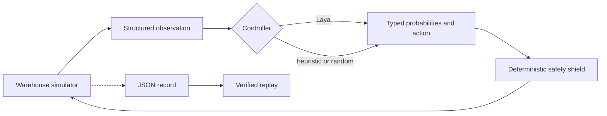

<div align="center">

# Laya Warehouse Safety

**A typed decision model, a busy warehouse, and one robot trying not to become an incident report.**

</div>

This project is a visual, replayable experiment in using
[Laya](https://github.com/NandhaKishorM/laya) as a fast operational decision layer for an
autonomous warehouse robot. Workers and forklifts move through a deterministic grid. The robot
must reach a loading bay while choosing whether to advance, shift, or wait.

The simulation keeps emergency collision prevention deterministic. Laya chooses operational
actions above that safety layer; it cannot override the safety shield.

## Why this experiment?

Laya evaluates several typed questions over one state in a single model invocation. A warehouse
crossing makes the result visible: a late or poor decision can cause an avoidable stop, detour, or
collision in an unshielded research run.

Each decision includes:

- `action` — `choice`: advance, shift left, shift right, or wait.
- `collision_risk` — `score`: low through critical.
- `path_blocked` — `noul`: probability that the direct path is blocked.
- `needs_operator` — `noul`: probability that a person should review the situation.

This repository is an experiment, not a certified robotics safety system.

## Architecture



Laya receives structured positions and motion descriptions. It does not process rendered pixels.

## Quick start

The headless simulator and tests have no runtime dependencies:

```sh
python -m venv .venv
source .venv/bin/activate
pip install -e .
python -m unittest discover -s tests

laya-warehouse run --controller heuristic --headless --output results/heuristic.json
laya-warehouse replay results/heuristic.json --headless
```

Install the visual renderer:

```sh
pip install -e '.[visual]'
laya-warehouse run --controller heuristic --output results/visual.json
```

Install Laya and run the model controller:

```sh
pip install -e '.[visual,laya]'
laya-warehouse run --controller laya --output results/laya.json
```

The first Laya run downloads the selected model checkpoint. Pass `--model` to use another model ID
or a local checkpoint, and `--device` to select `cpu`, `cuda`, or `mps`.

The recorder refuses to overwrite an existing result. Choose a new output path for each run.

### DGX Spark container

The container preserves NVIDIA's ARM64/Blackwell PyTorch build from the pinned NGC base image. It
does not replace Torch with a PyPI wheel.

```sh
docker compose build simulation
docker compose run --rm simulation
```

The first run downloads the Laya checkpoint into the `laya-cache` Docker volume and writes the
episode to `results/laya-dgx.json`.

## Current milestone

- Deterministic crossing scenario with workers and a forklift.
- Structured observations suitable for Laya.
- Heuristic, seeded-random, and Laya controllers.
- Safety shield that records every overridden action.
- JSON recording and deterministic replay verification.
- Optional Pygame visualization.
- Pinned DGX Spark GPU container path.

Planned work includes scenario files, real-time and delayed decision modes, probability overlays,
benchmark summaries, and curated replay media.

## License

Apache-2.0. See [LICENSE](LICENSE).
